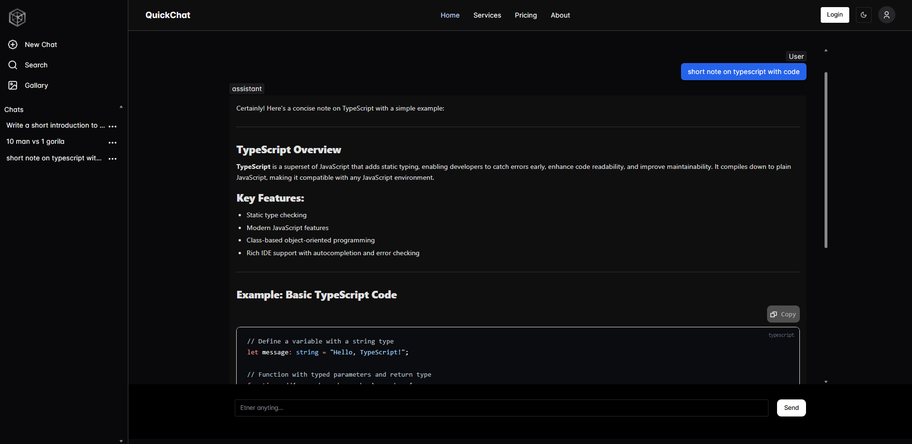
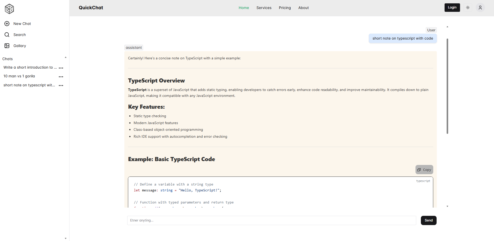

# 🚀 QuickChat AI Serverless Chat App

<p align="center">
  
  
  
</p>

  
  

# Introduction

QuickChat AI is a modern, open-source, serverless chat application that leverages AI to deliver seamless, real-time conversations. Built on the Puter platform, it combines a sleek user interface with powerful backendless technology, making intelligent chat accessible, fast, and easy to deploy anywhere.

## 📋 Table of Contents

- [Features](#features)
- [Tech Stack](#tech-stack)
- [Getting Started](#getting-started)
- [Usage](#usage)
- [Contributing](#contributing)
- [License](#license)
- [Contact](#contact)
- [Author](#author)

## Features

- 💬 Real-time AI-powered chat interface
- ☁️ Serverless architecture for easy deployment
- 🖥️ Modern UI built with React + Vite
- 📝 Markdown support in chat
- 💾 Persistent chat history (local storage)
- 🧩 Code highlights & copy-to-clipboard
- 📱 Responsive design, works on all devices

## Tech Stack

- ⚛️ React
- 🟦 TypeScript
- ⚡ Vite
- 🟣 chakra-ui (UI)
- 🦄 lucide-react (icons)
- 🤖 Puter (AI/backendless)

## Getting Started

1. Clone the repository:
   ```sh
   git clone https://github.com/avinashtare/QuickChat-AI.git
   cd QuickChat-AI
   ```
2. Install dependencies:
   ```sh
   npm install
   ```
3. Start the development server:
   ```sh
   npm run dev
   ```

## Usage

- 💬 Start chatting with the AI in the chat window.
- 📝 Use Markdown for rich text formatting.
- 📋 Copy code snippets with one click.
- 🌙 Toggle light/dark mode.
- 🧹 Clear chat history anytime.
- 🔄 Refresh to start a new conversation.

## License

Distributed under the MIT License. See [LICENSE](LICENSE) for more information.

## Contributing

Contributions are what make the open-source community such an amazing place to learn, inspire, and create. Any contributions you make are greatly appreciated.

1. Fork the Project
2. Create your Feature Branch (`git checkout -b feature/AmazingFeature`)
3. Commit your Changes (`git commit -m 'Add some AmazingFeature'`)
4. Push to the Branch (`git push origin feature/AmazingFeature`)
5. Open a Pull Request

## Contact

If you have any questions or suggestions about this project, please feel free to reach out.

Email: avinashtare.work@gmail.com

## Author

卐 🕉 Avinash Tare 🕉 卐
